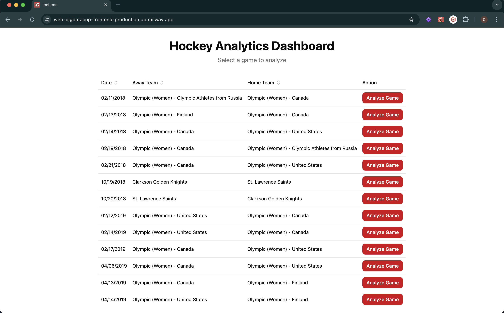
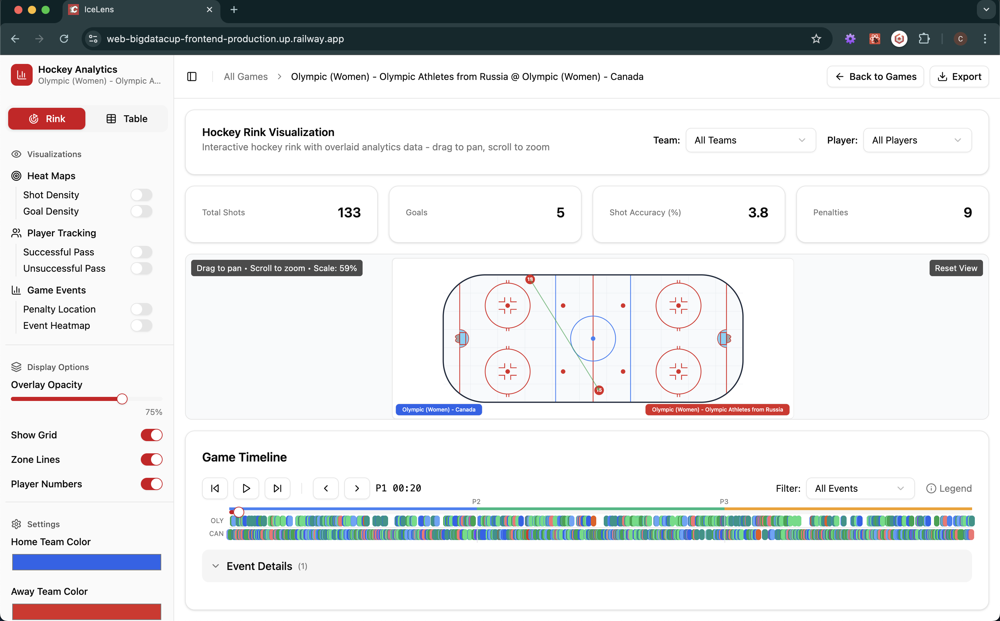
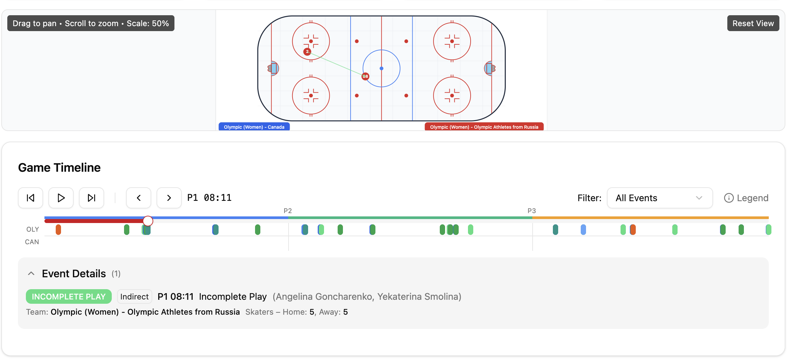
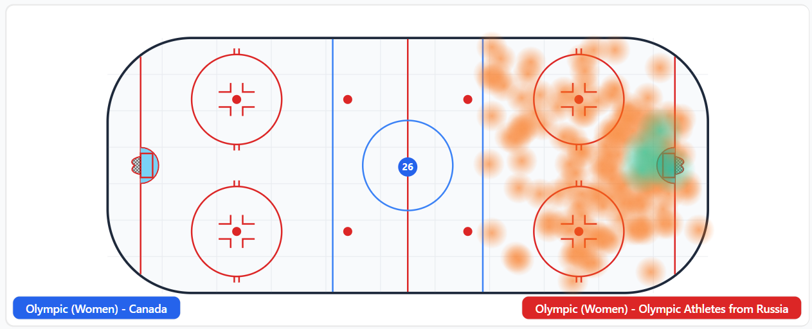
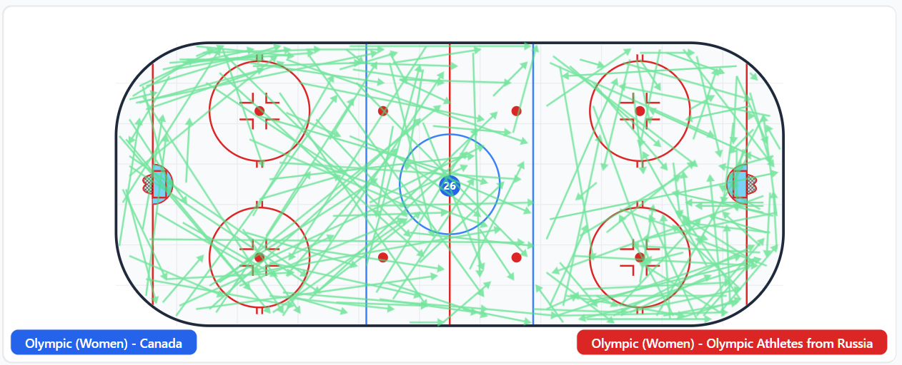
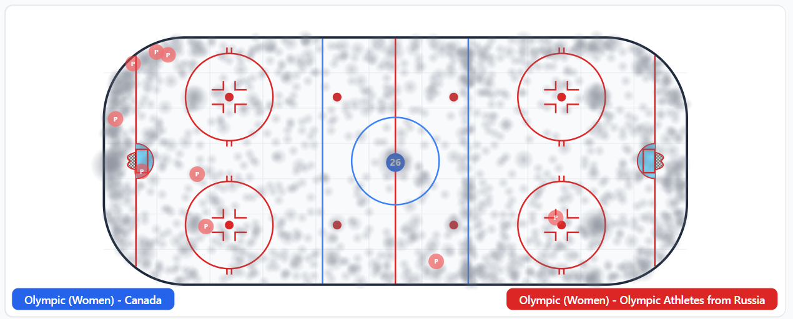
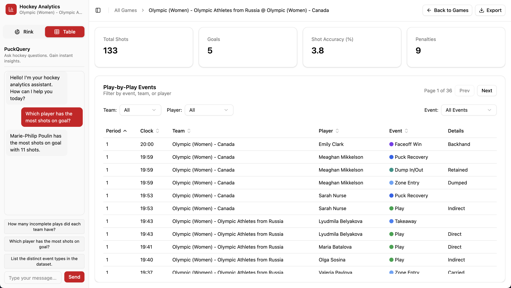

# Hockey Data Visualizer
This repository provides an easy-to-use visual interface for coaches or analysts to review and interact with historical hockey data, as provided by [Big Data Cup 2021](https://github.com/bigdatacup/Big-Data-Cup-2021). 

As this project is designed for submission to evaluate programming skill, creative thinking, and ability to design an easy-to-use interface, the README is organized as follows:
* [Exploratory Data Analysis / Ideation](#exploratory-data-analysis--ideation)
* [Methodology](#methodology)
* [Implementation](#implementation)
* [Deployment](#implementation)

## Exploratory Data Analysis / Ideation
Before undergoing any coding, the first step is to decide on an interesting, useful, and engaging visualization to pursue. As such, I perform exploratory data analysis (EDA) on the dataset to better understand the characteristics of the data. I first analyze the [Data Dictionary](#data-dictionary), perform EDA on each column and the entire dataset to better understand the data, and decide on which data points are necessary to create my desired visualization.

### Data Dictionary
| Column Name           | Data Type | Description                                                                 |
|-----------------------|-----------|-----------------------------------------------------------------------------|
| `game_date`           | Date      | Date of the game in YYYY-MM-DD format (e.g., '2020-12-23').               |
| `Home Team`           | String    | Name of the home team (e.g., 'Toronto Maple Leafs').                      |
| `Away Team`           | String    | Name of the away team (e.g., 'Boston Bruins').                            |
| `Period`              | Integer   | Period number (1-3 for regulation, 4+ for overtime periods).               |
| `Clock`               | String    | Time remaining in the period in MM:SS format (e.g., '19:34').              |
| `Home Team Skaters`   | Integer   | Number of skaters on ice for home team (range: 3-6 players).               |
| `Away Team Skaters`   | Integer   | Number of skaters on ice for away team (range: 3-6 players).               |
| `Home Team Goals`     | Integer   | Goals scored by home team at time of event.                                |
| `Away Team Goals`     | Integer   | Goals scored by away team at time of event.                                |
| `Team`                | String    | Name of team responsible for the event.                                    |
| `Player`              | String    | Name of primary player involved (shooter, passer, etc.).                   |
| `Event`               | String    | Event type: Shot, Goal, Play, Incomplete Play, Takeaway, Puck Recovery, Dump In/Out, Zone Entry, Faceoff Win, Penalty Taken. |
| `X Coordinate`        | Integer   | X-coordinate of event location on ice (0-200), from eventing team's perspective. |
| `Y Coordinate`        | Integer   | Y-coordinate of event location on ice (0-85), from eventing team's perspective. |
| `Detail 1`            | String    | Primary event detail: Shot type (Deflection, Fan, Slapshot, Snapshot, Wrap Around, Wristshot), Pass type (Direct, Indirect), Entry type (Carried, Dumped, Played), Possession outcome (Retained, Lost), or Penalty type. |
| `Detail 2`            | String    | Secondary detail: Shot destination (On Net, Missed, Blocked) for shots/goals. |
| `Detail 3`            | String    | Tertiary detail: Traffic indicator (true/false) for shots/goals.           |
| `Detail 4`            | String    | Additional detail: One timer indicator (true/false) for shots/goals.       |
| `Player 2`            | String    | Secondary player: Pass target, faceoff opponent, penalty drawer, targeted defender. |
| `X Coordinate 2`      | Integer   | Secondary X-coordinate: Pass target location, varies by event type.        |
| `Y Coordinate 2`      | Integer   | Secondary Y-coordinate: Pass target location, varies by event type.        |

In addition to `olympic_womens_dataset.csv` included in the repository (`backend/data/olympic_womens_dataset.csv`) as provided by the organizer, there is tracking data provided in the BigDataCup GitHub repository; however, the data provided in `TrackingData` is for a different dataset. Future extension of this application could implement player location tracking throughout the entire game; however, due to the nature of our limited dataset, we only have the ability to include location information a per-event basis.

### Insights
Considering the coordinate-based nature of this dataset, have a **clean visualization of the rink** would make for useful analysis and actionable insights. Additionally, as we are working with many events over time, a timeline visualization can help better understand the temporal insights over the course of the game. I also include heatmap (and other) visualizations overtop of the rink visualization to better identify 'hot-zones'.

It's interesting to note that Passes (Play/Incomplete Play) are the only events which ave two sets of coordinates, which we can use to draw a line between players. We may also be able to infer secondary coordinates for "Goals", considering we know the location of the nets, but choose not to include this as the exact position of puck entry into the net is crucial inforation we do not have.

For Shots and Goals, we have addtional detailed information (Traffic, One-Timer) that could be used for additional analysis.

## Methodology
### Frontend Design
In the following section I explained preliminary design and technical decisions regarding the frontend of the full-stack application.

#### UX/UI
Navigating data-heavy visualizations can be challenging, and as such, **clean and simple designs** that abstract away as much decision-making as possible lead to better user experiences. However, technical stakeholders (analysts) may appreciate the ability to dive deeper into game insights and perform their own detailed analysis. As such, one key feature is **the ability to export game data to csv**, to provide extended use if desired.

The design follows a standard "Dashboard" design with a feature-rich sidebar on the left-hand side of the screen, and visualizations/data being displayed in the main section of the application. 

The webpage is split up between two types of useful visualizations: (1) Rink Visualizations and (2) Table Visualizations. Rink allows for an interactive visual analysis of games whereas Table visualizations summarizes player statistics and performance on a clean interface.

For **theming**, we consider the [Calgary Flames team colors](https://teamcolorcodes.com/calgary-flames-color-codes/) for consistency with the team and likely other applications in use by the team.
* Red #D2001C
* Yellow #FAAF19
* White #FFFFFF
* Black #111111

Keeping readability and simplicity as forefront design concepts, I choose to only integrate the Red (#D2001C) as a "Primary" accent color in the application.

#### Component Library
Rather than building out custom components (which could be considered in the futre), I've opted to leverage an existing component library to speed up development. I've used a number of component libraries but recently gravitate towards Shad.cn for its extensive accessibilioty support and customizabiltity. This choice will support custom extension in the future if desired, unlike other component libraries which restrict styling behind their library.

#### Technical Stack
Considering we are aiming to make an interesting, engaging, and useful data visualization, there are many options available. Python can provide great functionality out of the box with plotting libraries such as `matplotlib`, `plotly` and many others. I considered using `streamlit` as a way to provide an all-inclusive framework for easy development and deployment.

`Streamlit` would be a great framework considering it is `Python`-based, and there is an incoming dataset available (no backend needed). `Streamlit` is limited in that it cannot be deployed with any backend, as the framework itself is tightly coupled and not extensible. For simple charts, graphs, tables, and experimenting with classical machine learning methods, Streamlit is a great pick.

However, as we are working with X, Y data, and want to create an engaging custom visualizations, I will choose `React` as a more extensible, customizable frontend framework for development as there are many more charting/graphing libraries available in Javascript.

### Backend Design
In the following section I explained preliminary design and technical decisions regarding the backend of the full-stack application.

#### Database Design
Considering I would like to design for an extensible application, with the ability to add future game data if desired, I have opted to include a database and client/server architecture. As we will have very limited writes, and a low-traffic of read operations, `SQLite` will be more than sufficient for our purposes.

While the application could be build entirely on the frontend, for the purposes of this assignment it's important to demonstrate full-stack expertise, which often includes client/server architecture. Designing with extensibility in mind, if coaches or analysts wanted to upload their own data in the future for analysis within this application, a backend will be needed to manage the write operations into a backend database. Additionally, having a database provides the option to create backups and redundancy, vertical or horizontal scaling, and use within other applications.

#### Technical Stack
Considering `Python`-based backend web development libraries, there are three options I have used in the past: (1) Django, (2) Flask, and (3) FastAPI. Since this application requires a database and read-write options, Django may be a good option as it has many features out of the box (ORM, Admin Panel, etc). However, since I have decided to use a React frontend, there will be a lot of boilerplate provided which will not be used. While the Admin Panel may be a good feature to provide coaches and analysts with the ability to add their own data, and there is the option to easily integrate skins/plug-ins into Django, as the scope of our application is small I will not consider this option.

Comparing Flask vs FastAPI, I have more experience with FastAPI and have chosen it over Flask as it has better built in asynchronous support, is generally faster, and has better type validation enforced via Pydantic. As I'm building only a handful of small APIs, Flask or FastAPI would be great choices, although require the additional integration of an ORM (if desired).

## Implementation
### Feature List
#### 🔮 Frontend Features
* 🎨 UI/UX & Visualizations
    * Dashboard-style interface with:
        * 📊 Interactive rink visualizations
            * Heatmaps of event density (shots, goals, all events)
            * Pass visualizations (lines between coordinate pairs)
            * Penalty locations
        * 📋 Table visualizations
            * Player stats and game summaries in tabular format
    * Responsive and clean layout using:
        * 📂 Sidebar for feature navigation
        * 🖼️ Main content area for visualizations
    * 🟥 Theming based on Calgary Flames colors

* ⚙️ Functionality
    * 📤 Export to CSV for data reuse and analysis
    * 🧭 Timeline visualization to show event sequences
    * 🖱️ Interactive controls for filtering or selecting games/events
    * 💬 PuckQuery: AI-powered chatbot interface
        * Allows non-technical users to ask natural language questions
        * Enables custom queries not covered by built-in filters
#### ⚙️ Backend Features
* 🗃️ Data Management
    * SQLite database to store:
        * Parsed game data
        * Event details
        * Player and team metadata


* 🔌 API Services
    * 🧾 RESTful API endpoints for:
        * Fetching filtered game data
        * Retrieving event logs per game
        * Serving CSV data for download
* 🛠️ Design Considerations
    * Modular architecture for:
        * Future database migration (SQLite → PostgreSQL)
        * Scaling via containerization (Docker)
        * API integration with other hockey analysis tools
### Screens
#### Landing Page


#### Rink Visualization


Event Details


Shot and Goal Density Heatmap


Plays and Incomplete Plays Visualization


Penalty Locations and Overall Event Density

#### Table Visualization
Table Data and PuckQuery Chatbot


### Video Walkthrough
A video walkthrough of this application can be found at this [link](https://www.youtube.com/watch?v=8DX7Ovqu6Js) or embedded below.

[](https://www.youtube.com/watch?v=8DX7Ovqu6Js)

## Deployment
The easiest way to deploy is via [Docker](#docker-deployment), if you have Docker or Docker Desktop installed, locally.

### Secrets Management
To run this application with any either the Local Deployment or Docker Deployment methods, we must create new `.env` files within the `frontend/` and `backend/` folders, respectively.
1. Copy `.env.example` and rename to `.env`
2. Populate each env variable.

**Frontend Environment Variables**
```
# Color Configuration
VITE_PLAYER_NODE_RADIUS=
VITE_PLAYER_NODE_STROKE_WIDTH=
VITE_PLAYER_NODE_STROKE_COLOR=
VITE_PLAYER_NODE_FILL_HOME=
VITE_PLAYER_NODE_FILL_AWAY=

# Deployment
VITE_API_URL=
```

**Backend Envrionment Variables**
```
ALLOWED_ORIGINS=
OPENAI_MODEL=
OPENAI_API_KEY=
```

### Local Deployment
After configuring the environment variables, run the following commands to deploy the application locally.
**Frontend**
```bash
# Change directory to frontend
cd frontend

# Install dependencies and run application
npm install
npm run dev
```
**Backend**
```bash
# Configure environment and dependencies
cd backend
conda create -n bigcupdata python=3.10
conda activate bigcupdata
pip install -r requirements.txt

# Run application
uvicorn src.main:app --reload
```
### Docker Deployment
The easiest way to deploy is via Docker. While the application can be run with two separate dockerfiles, once we have our environment variables configured we can simply deploy via the `compose.yml`.

Run the following command in a terminal (ensure you have Docker running):

```
docker compose up
```

### Cloud Deployment
I have deployed this application live using [Railway](https://railway.com/) as they provide a low-cost 'hobby-tier' for small applications. The link for the live application (up still up and running) can be found [here](https://icelens-production.up.railway.app/).

python -m data_analysis.eda
python -m data_analysis.split_games